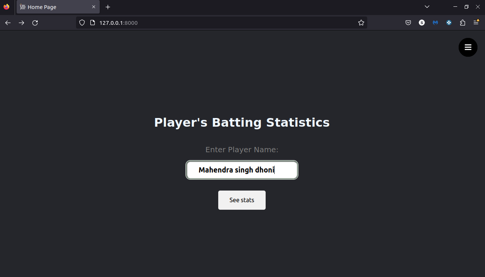
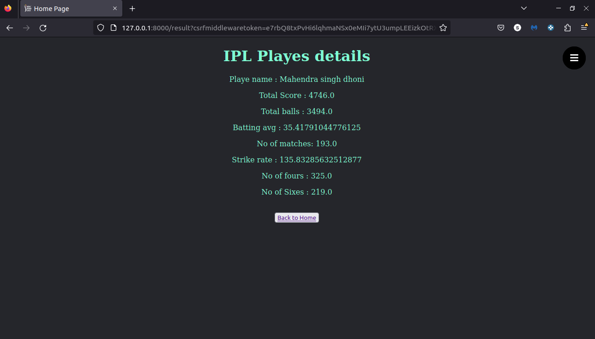

# Django - KDB Application

### This is IPL players details dashboard. 
#### Here you can enter players name and get the players batting statistics. This is just POC model to connect KDB+ with Django.

Screen Shots

Home page:

Result page:

